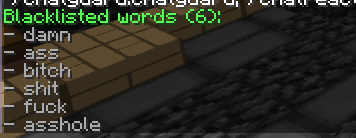

# 💬 ChatGuard ( Made using AI just for fun )

**ChatGuard** is a powerful and lightweight **Minecraft chat protection plugin** designed to keep your server chat **clean, safe, and enjoyable** for everyone.

It automatically detects and handles:
- 🚫 Foul Language  
- 📢 Advertising  
- 🔁 Spam  
- 🌊 Chat Flood  

---

## ⚙️ Features

- Filters and blocks **offensive words**
- Detects and prevents **advertising links or IPs**
- Limits **repeated messages and letters**
- Real-time **staff notifications**
- Fully **customizable messages**
- Easy to manage through **commands and config.yml**

---

## 🧩 Commands

| Command | Description |
|----------|-------------|
| `/chatguard add <word>` | Add a new banned word |
| `/chatguard remove <word>` | Remove a banned word |
| `/chatguard list` | Show all banned words |
| `/chatguard reload` | Reload the configuration |
| `/chatguard alert <message>` | Send a ChatGuard staff alert |

---

## 🔑 Permissions

| Permission | Description |
|-------------|-------------|
| `chatguard.notify` | Allows staff to receive alert notifications |
| `chatguard.admin` | Allows full administrative access to ChatGuard commands |

---

## ⚙️ Configuration (`config.yml`)

```yaml
# ChatGuard Configuration File
# Colors: &0-&f, &l (bold), &o (italic), &n (underline), &m (strikethrough), &k (magic), &r (reset)

# Notification message formats (supports %player% and %word% placeholders)
notification-format: '&c[ChatGuard] &e%player% &ctyped the word &e"%word%" &cin the chat'
spam-format: '&c[ChatGuard] &e%player% &cspammed in the chat'
flood-format: '&c[ChatGuard] &e%player% &ctriggered flood detection'
ads-format: '&c[ChatGuard] &e%player% &ctried to advertise'

staff-permission: chatguard.notify
admin-permission: chatguard.admin

max-repeat-messages: 3
max-repeat-letters: 12

block-ads: true
normalize-words: true

badword-replace-mode: replace
replacement-word: '#CENSORED#'

debug-mode: true
````

---

## 🖼️ Gallary

### 💬 Foul Language Detection


### 🚫 Spam Detection


### 📢 Advertisement Block


### ⚫ Blacklist Management



### ⚙️ Commands & Config Preview


---

**Created with ❤️ to keep your Minecraft chat safe and friendly.**
